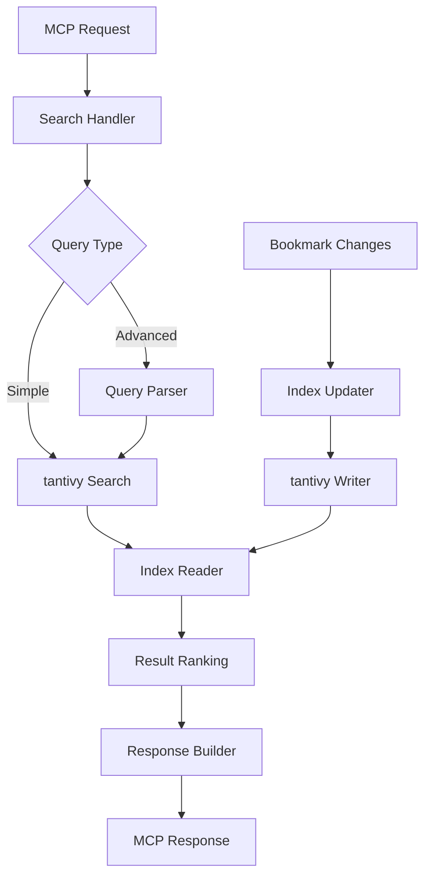
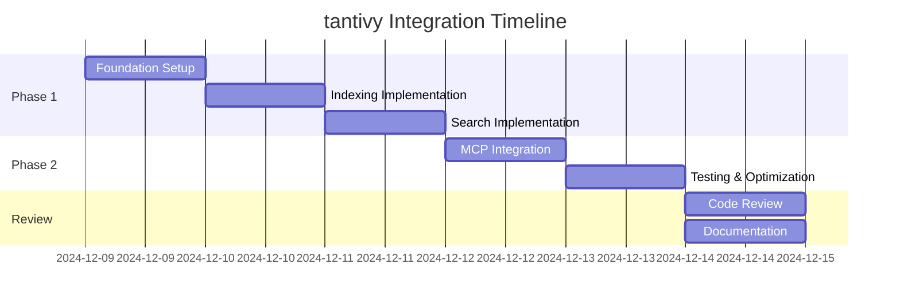

# Statement of Work: tantivy Integration for Chrome Bookmark MCP Server

## 📋 Overview

### Project Name
Full-text Search Integration using tantivy

### Duration
1 week (5 business days)

### Objective
Integrate tantivy full-text search engine to enable content-based search capabilities for bookmarked documentation, allowing developers to quickly find relevant technical information from their curated bookmark collection.

## 🎯 Goals

### Primary Goals
1. Enable full-text search across bookmark titles, URLs, and fetched content
2. Improve search performance from O(n) to O(log n)
3. Support advanced query syntax for developer-friendly searches
4. Maintain sub-100ms search response times

### Secondary Goals
1. Implement incremental index updates
2. Add search result ranking by relevance
3. Support faceted search by folder and domain
4. Enable date-range filtering

## 📊 Current State Analysis

### Existing Search Limitations
- **Scope**: Only searches bookmark title and URL
- **Performance**: Linear search through all bookmarks
- **Accuracy**: Simple substring matching, case-insensitive only
- **Filtering**: Limited to folder-based filtering

### Target Improvements
| Metric | Current | Target |
|--------|---------|--------|
| Search scope | Title + URL | Title + URL + Content |
| Search time (10k bookmarks) | ~500ms | <50ms |
| Query syntax | Simple substring | Boolean operators, phrases |
| Result ranking | None | TF-IDF relevance scoring |

## 🏗️ Technical Architecture

### Index Schema Design

```rust
// tantivy index fields
struct BookmarkSchema {
    // Stored and indexed fields
    id: String,           // Unique bookmark ID
    url: Text,           // Full URL (stored, indexed)
    title: Text,         // Page title (stored, indexed)
    content: Text,       // Page content (indexed, not stored due to size)
    
    // Faceted fields for filtering
    folder_path: Facet,  // Hierarchical folder structure
    domain: Facet,       // Website domain for filtering
    
    // Metadata fields
    date_added: Date,    // For time-based filtering
    date_modified: Date, // For freshness scoring
    tags: Text,          // User and auto-generated tags
    
    // Content metadata
    language: Facet,     // Programming language detection
    doc_type: Facet,     // API docs, tutorial, blog, etc.
}
```

### Component Integration



## 📝 Implementation Plan

### Day 1: Foundation Setup
- [ ] Add tantivy dependency to Cargo.toml
- [ ] Create index module structure
- [ ] Design and implement schema
- [ ] Write index initialization code
- [ ] Add index path configuration

```toml
# Cargo.toml additions
[dependencies]
tantivy = "0.22"
tempfile = "3.8"  # For index directory management
```

### Day 2: Indexing Implementation
- [ ] Create bookmark indexer
- [ ] Implement document builder from FlatBookmark
- [ ] Add content field population
- [ ] Implement initial index building
- [ ] Add progress logging

```rust
// Example indexer interface
pub struct BookmarkIndexer {
    index: Index,
    schema: Schema,
}

impl BookmarkIndexer {
    pub fn index_bookmark(&mut self, bookmark: &FlatBookmark, content: Option<&str>);
    pub fn commit(&mut self) -> Result<()>;
    pub fn optimize(&mut self) -> Result<()>;
}
```

### Day 3: Search Implementation
- [ ] Implement basic search functionality
- [ ] Add query parser for advanced syntax
- [ ] Implement result collector
- [ ] Add relevance scoring
- [ ] Create search response formatter

```rust
// Search interface
pub struct SearchQuery {
    pub text: String,
    pub folders: Vec<String>,
    pub date_range: Option<(DateTime, DateTime)>,
    pub limit: usize,
}

pub struct SearchResult {
    pub bookmark_id: String,
    pub title: String,
    pub url: String,
    pub score: f32,
    pub snippet: Option<String>,
}
```

### Day 4: MCP Integration
- [ ] Add search tool to MCP server
- [ ] Implement search request handler
- [ ] Add index management commands
- [ ] Integrate with existing bookmark reader
- [ ] Update configuration

```rust
// New MCP tool
#[tool(description = "Full-text search across bookmarks and content")]
async fn search_bookmarks_fulltext(
    &self,
    Parameters(req): Parameters<FulltextSearchRequest>,
) -> Result<CallToolResult, McpError>
```

### Day 5: Testing & Optimization
- [ ] Write unit tests for indexer
- [ ] Write integration tests for search
- [ ] Performance benchmarking
- [ ] Memory usage optimization
- [ ] Documentation updates

## 🧪 Testing Strategy

### Unit Tests
- Schema creation and validation
- Document building from bookmarks
- Query parsing edge cases
- Index update operations

### Integration Tests
- End-to-end search workflow
- MCP protocol compliance
- Concurrent search handling
- Index corruption recovery

### Performance Tests
- Index 10,000 bookmarks benchmark
- Search response time with various query complexities
- Memory usage under load
- Concurrent search stress test

## 📈 Success Metrics

### Performance Metrics
- [ ] Search response time < 100ms for 10k bookmarks
- [ ] Index size < 2x total bookmark text size
- [ ] Memory usage < 200MB during normal operation
- [ ] Index update time < 1s for single bookmark

### Functionality Metrics
- [ ] Support for Boolean queries (AND, OR, NOT)
- [ ] Phrase search with exact matching
- [ ] Wildcard and fuzzy search support
- [ ] Minimum 90% precision in search results

### User Experience Metrics
- [ ] Zero-downtime index updates
- [ ] Graceful degradation on index corruption
- [ ] Clear error messages for invalid queries
- [ ] Progressive result loading for large result sets

## 🚀 Rollout Plan

### Phase 1: Alpha (Internal Testing)
- Deploy to test environment
- Index sample bookmark set (1000 items)
- Validate search accuracy
- Performance profiling

### Phase 2: Beta (Limited Release)
- Add feature flag for tantivy search
- Allow opt-in via configuration
- Collect usage metrics
- Gather user feedback

### Phase 3: General Availability
- Enable by default for new installations
- Provide migration tool for existing users
- Remove legacy search code (after deprecation period)
- Update documentation

## 🔧 Configuration

```toml
# config.toml
[search]
engine = "tantivy"  # or "legacy" for old search

[search.tantivy]
index_path = "~/.mcp-bookmark/index"
max_results = 100
enable_content_search = true
enable_fuzzy = true
fuzzy_distance = 2
commit_interval_sec = 30

[search.tantivy.scoring]
title_boost = 2.0
url_boost = 1.5
content_boost = 1.0
recency_boost = 0.5
```

## 📚 Dependencies

### Required Crates
- `tantivy = "0.22"` - Full-text search engine
- `tempfile = "3.8"` - Temporary directory management
- `chrono = "0.4"` - Date/time handling for date fields

### Optional Enhancements
- `regex = "1.10"` - Advanced pattern matching
- `unicode-segmentation = "1.10"` - Better text tokenization
- `lingua = "1.6"` - Language detection

## ⚠️ Risks & Mitigations

### Technical Risks
| Risk | Impact | Mitigation |
|------|--------|------------|
| Index corruption | High | Implement auto-recovery and rebuild command |
| Memory overflow with large indexes | Medium | Implement index size limits and pagination |
| Search query injection | Low | Use tantivy's built-in query sanitization |
| Performance degradation | Medium | Add index optimization schedule |

### Implementation Risks
| Risk | Impact | Mitigation |
|------|--------|------------|
| Scope creep | High | Strict adherence to defined features |
| Breaking changes | Medium | Feature flag for gradual rollout |
| Learning curve | Low | Comprehensive documentation and examples |

## 📖 Documentation Requirements

### Developer Documentation
- [ ] Index schema documentation
- [ ] Search query syntax guide
- [ ] Performance tuning guide
- [ ] Troubleshooting guide

### User Documentation
- [ ] Search operators reference
- [ ] Configuration guide
- [ ] Migration guide from legacy search
- [ ] FAQ section

## ✅ Definition of Done

### Code Complete
- [ ] All planned features implemented
- [ ] Unit test coverage > 80%
- [ ] Integration tests passing
- [ ] No critical lint warnings

### Documentation Complete
- [ ] API documentation updated
- [ ] User guide written
- [ ] Configuration examples provided
- [ ] README.md updated

### Quality Assurance
- [ ] Performance benchmarks met
- [ ] Memory usage within limits
- [ ] Error handling comprehensive
- [ ] Logging implemented

### Deployment Ready
- [ ] Feature flag configured
- [ ] Rollback plan documented
- [ ] Monitoring alerts configured
- [ ] Release notes prepared

## 👥 Stakeholders

- **Developer**: Primary implementer
- **Users**: Chrome bookmark MCP server users
- **Reviewers**: Code review and testing

## 📅 Timeline



## 🎯 Next Steps

After successful implementation:
1. Semantic search using embeddings (Phase 2)
2. Auto-tagging based on content analysis
3. Search analytics and query optimization
4. Multi-language support
5. Incremental content re-fetching

## 📝 Notes

- Consider using tantivy's built-in highlighting for search result snippets
- Implement graceful fallback to legacy search if index is unavailable
- Monitor index size growth and implement cleanup strategies
- Consider implementing search suggestions based on query history